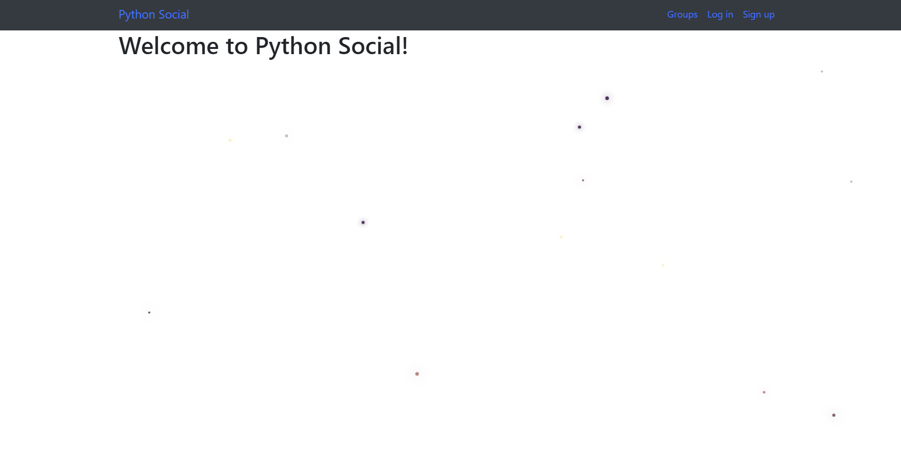
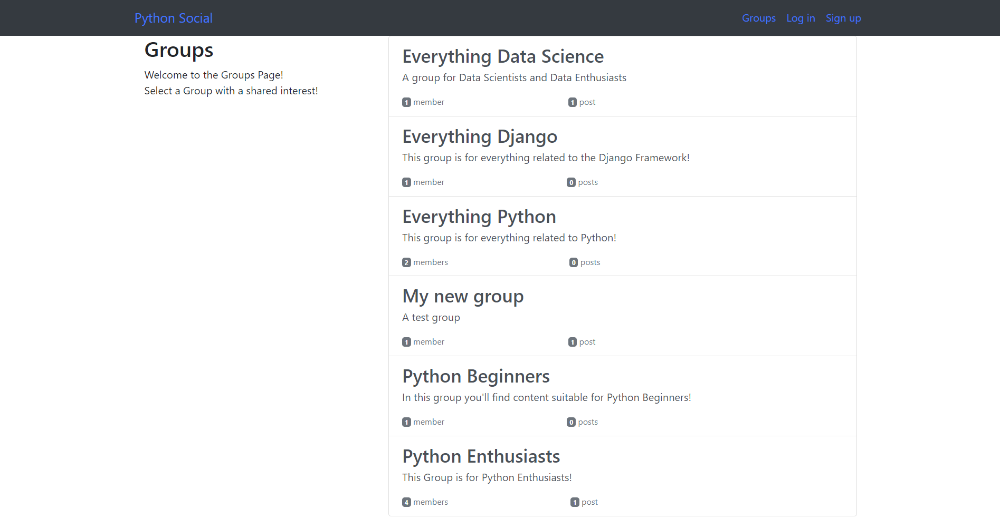
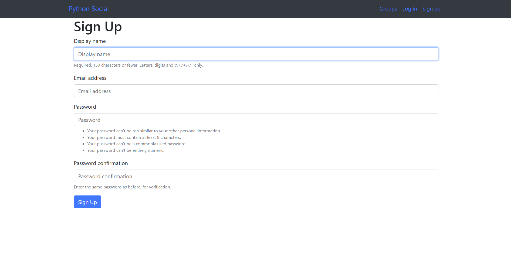
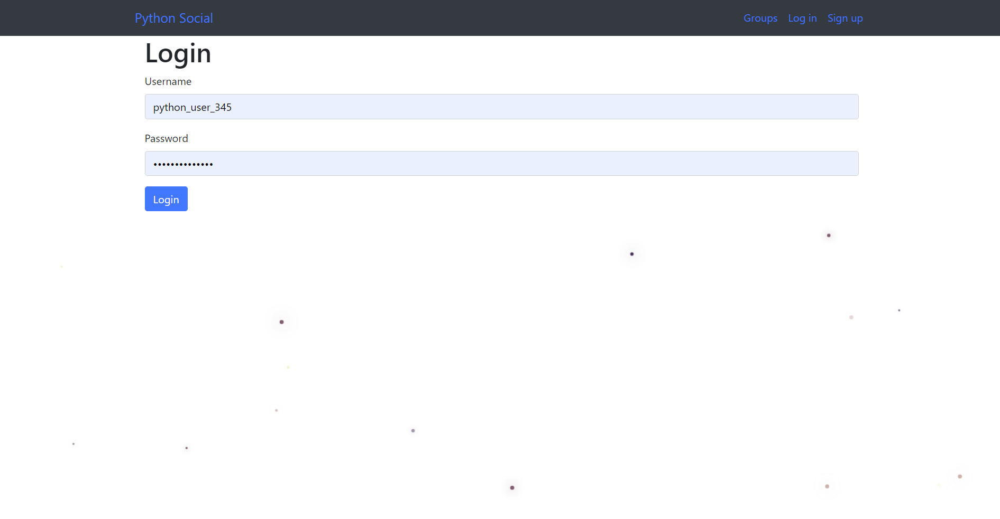
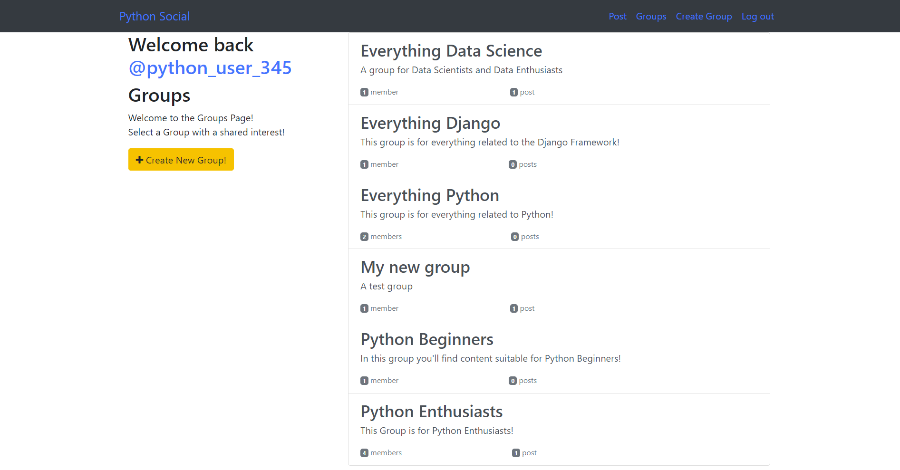
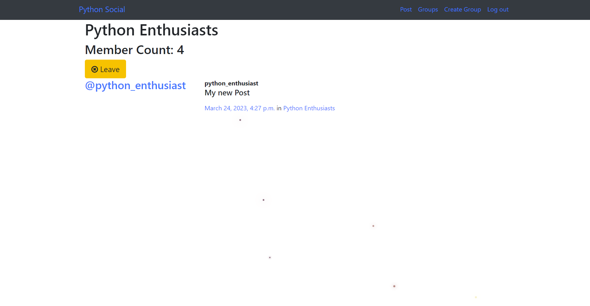
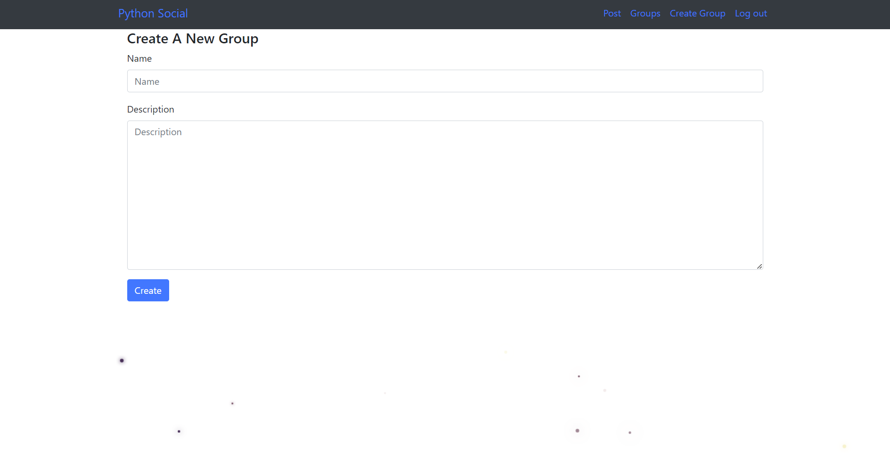
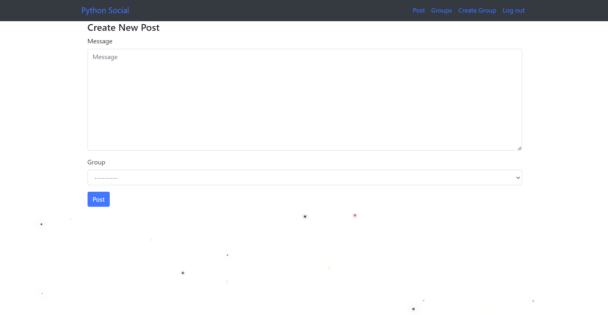
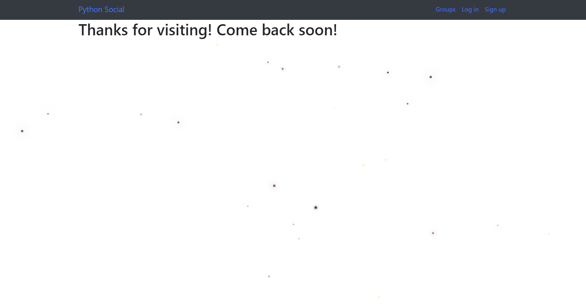

# Python Social

A social site Django project for Pythonistas. Created by following code along lectures in this [Full Stack Web Development](https://www.udemy.com/course/python-and-django-full-stack-web-developer-bootcamp/) Udemy Course. 

## Features

- Explore groups and posts without signing up
- Register/Signup
- Login
- Create Groups
- Join and leave groups
- Create and delete posts
- List all posts of a group
- Logout

## Setup

1. Clone Repository
1. Create virtual environment and install Django Version 4. Check this [Installation Guide](https://developer.mozilla.org/en-US/docs/Learn/Server-side/Django/development_environment)
1. Activate virtual environment and install the following packages

1. Bootstrap: To make the forms look a little nicer
    ```
    pip install django-bootstrap4
    ```
1. misaka: Allows link embedding, markdown text, etc in comments similar to reddit
    ```
    pip install misaka
    ```
1. braces: Allows to access some convenient mixins to use with CBVs
    ```
    pip install django-braces
    ```
1. Go to the project root folder
    ```
    cd my_social_site
    ```
1. Migrate Databases
    ```
    python manage.py makemigrations accounts groups posts
    python manage.py migrate
    ```
1. Runserver and open the link in a browser (Chrome suggested):
    ```
    python manage.py runserver
    ```

## Testing with existing Users

1. Python Enthusiast
    ```
    Display name: python_enthusiast
    Email: python_enthusiast@example.com
    Password: ILovePython1234!
    ```

1. Python Beginner
    ```
    Display name: python_beginner_1
    Email: python_beginner_1@sample.com
    Password: ImLearningPython5678!
    ```

1. Python User 1
    ```
    Display name: user_123
    Email: user_123@example.com
    Password: ImAPythonUser2222!
    ```

1. Python User 2
    ```
    Display name: python_user_345
    Email: python_user_345@example.com
    Password: ImAUser334455!
    ```

## Screenshots

1. Homepage

1. Group List without login

1. Signup

1. Login

1. Group List after login

1. Group Detail

1. Create Group

1. Create Post

1. Logout



